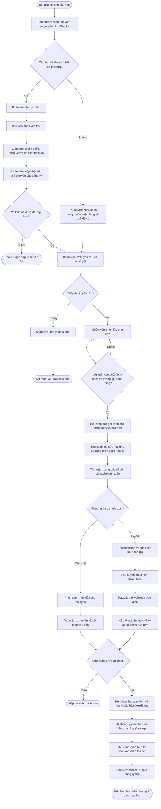
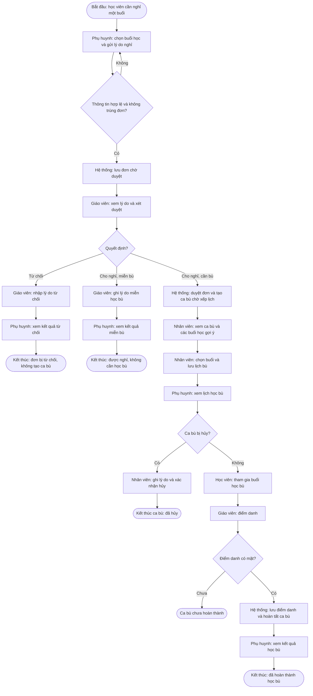

# Flowchart nghiệp vụ xuyên suốt

Mỗi ô ghi người thực hiện và công việc. Hình thoi là điểm quyết định; đọc theo mũi tên từ đầu đến cuối. Các bước giao tiếp, tham gia test và tham gia học là ngữ cảnh nghiệp vụ, không hàm ý có thông báo tự động trong phần mềm.

## 1. Từ nhu cầu học đến ghi danh chính thức

Lưu ý triển khai: bước chấm test lưu vào `placement_schedules`, còn cập nhật kết quả ghi danh đọc `placement_tests`; code hiện chưa đồng bộ hai nguồn. Do đó nhánh chờ kết quả là điểm dừng thực tế nếu nguồn xếp lớp chưa có kết quả. Việc gửi yêu cầu có test không tự tạo lịch test. Trạng thái chờ không phải kết thúc thành công; tiếp tục khi có kết quả hoặc thanh toán hợp lệ. Sơ đồ thể hiện phân công nghiệp vụ điển hình, không phải bảng phân quyền API.

## 2. Từ xin nghỉ đến giải quyết học bù

Project chưa thể hiện luồng tự động tạo ca thay thế sau khi hủy hoặc vắng buổi bù; vì vậy không tự nối các nhánh này về bước xếp lịch mới. Giáo viên là người xét duyệt và điểm danh điển hình; code còn cho phép các vai trò nhân sự khác thực hiện một số thao tác này.

Nguồn đối chiếu: các service trong `features/course_enrollment`, `features/placement_test`, `features/tuition_payment` và `features/attendance_makeup` thuộc backend. Đã đọc code, chưa kiểm thử hành trình bằng giao dịch thực tế.
