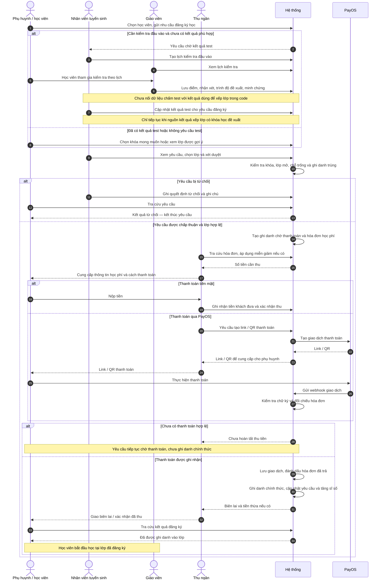
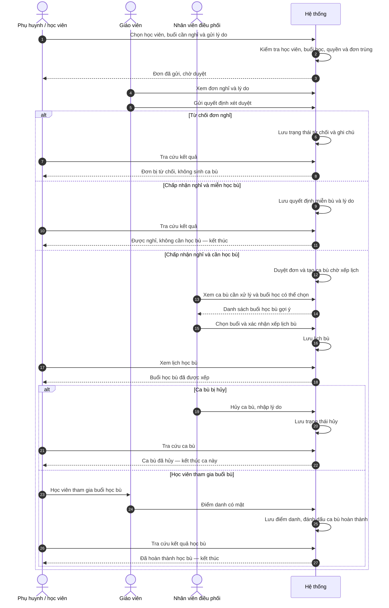

# Luồng nghiệp vụ xuyên suốt theo người thực hiện

Tài liệu này thay cách chia theo tính năng trong `data-flow.md` bằng hành trình nghiệp vụ từ đầu đến cuối. Mỗi cột là một người tham gia; đọc từ trên xuống, mũi tên thể hiện bàn giao công việc/thông tin. Cột hệ thống chỉ thể hiện xử lý tự động.

Phạm vi dựa trên code hiện tại. Các tương tác ngoài phần mềm như tham gia test, giao tiền, tham gia lớp là ngữ cảnh nghiệp vụ; không hàm ý project có API hay thông báo tự động cho mọi tương tác đó. Giả định tài khoản, hồ sơ học viên, khóa học và lớp đã có sẵn.

## 1. Từ nhu cầu học đến ghi danh chính thức

Đăng ký test, chọn khóa, xét duyệt, xếp lớp và thanh toán là các bước của cùng một luồng tuyển sinh — ghi danh.

Điểm bắt đầu: phụ huynh có nhu cầu cho học viên theo học. Kết quả hoàn thành: học viên được ghi danh chính thức sau thanh toán; nhánh từ chối kết thúc yêu cầu, nhánh chưa thanh toán vẫn đang chờ.

### Giới hạn triển khai cần phân biệt với hành trình nghiệp vụ

- Phụ huynh gửi nhu cầu test trong yêu cầu đăng ký học; nhân viên tạo lịch test bằng thao tác riêng. Gửi yêu cầu không tự sinh lịch test.
- Giáo viên chấm và lưu vào `placement_schedules`, còn chức năng cập nhật kết quả cho ghi danh đọc `placement_tests`. Hiện chưa có đồng bộ giữa hai nguồn; bước tiếp tục xếp lớp chỉ chạy được khi nguồn thứ hai có kết quả phù hợp. Không có thao tác thủ công trên UI được xác nhận để nối hai nguồn này.
- Sơ đồ mô tả đường thanh toán tiền mặt và tích hợp PayOS. Webhook ngân hàng mô phỏng là công cụ demo, không phải một người hay một bước nghiệp vụ thật.
- Các bước cung cấp lịch, học phí, QR và biên lai giữa nhân viên với phụ huynh là bàn giao nghiệp vụ; không khẳng định có email/SMS tự động.
- Ngoài luồng duyệt yêu cầu, API tạo phiếu trực tiếp có thể tạo ghi danh chờ thanh toán và hóa đơn rồi nhập vào cùng đoạn thu tiền. Đây là lối vào khác của cùng luồng ghi danh, không phải nghiệp vụ thanh toán độc lập.
- Khi lớp không hợp lệ, hệ thống báo lỗi; nhân viên cần chọn lại lớp hợp lệ để tiếp tục. Code không có luồng danh sách chờ tự động.

## 2. Từ nhu cầu nghỉ một buổi đến giải quyết việc học bù

Điều kiện bắt đầu: đã có học viên và buổi học. Gửi đơn, duyệt nghỉ, xếp ca bù và điểm danh nối thành một luồng xử lý việc vắng học.

- Vai trò trên sơ đồ là phân công nghiệp vụ điển hình. Code cũng cho một số vai trò nhân sự khác duyệt hoặc điểm danh; không có nghĩa duy nhất giáo viên được làm.
- Điểm danh `PRESENT` tự hoàn tất ca bù đang `SCHEDULED` khớp học viên/buổi học. Có thao tác hoàn tất riêng, đồng thời tạo/cập nhật điểm danh có mặt.
- Nếu học viên chưa được điểm danh có mặt, không suy ra ca bù đã hoàn thành. Project chưa thể hiện luồng tự động xử lý bỏ buổi bù tiếp theo.
- Ca bị hủy kết thúc ca đó; chưa có luồng tự sinh ca thay thế được xác nhận.

## 3. Nghiệp vụ hỗ trợ vận hành

Admin tạo cơ sở, phòng và thiết bị để duy trì danh mục phục vụ vận hành. Admin/người xem báo cáo tra cứu lịch sử thu tiền theo thời gian và thu ngân sau khi các giao dịch được ghi nhận. Đây là công việc hỗ trợ hoặc kiểm soát kết quả của vận hành; không cần tách đăng ký test, ghi danh, thu tiền thành ba hành trình độc lập.

Code hiện chưa có chuỗi hoàn chỉnh từ tạo cơ sở đến tự động lập lớp/lịch học, cũng chưa có hành trình kết thúc khóa hoặc hoàn tiền được xác nhận. Vì vậy không bổ sung các bước này vào hai luồng chính.

## Đối chiếu mã nguồn

Các đường dẫn dưới đây tương đối với `com_be/src/main/java/com/talent/management/`:

- `features/course_enrollment/service/CourseEnrollmentService.java`: yêu cầu đăng ký, khuyến nghị, quyết định, ghi danh chờ thanh toán và hóa đơn.
- `features/placement_test/service/impl/PlacementTestServiceImpl.java`: lịch test, đánh giá và nguồn kết quả đề xuất.
- `features/tuition_payment/service/impl/TuitionPaymentServiceImpl.java`: miễn giảm, thu tiền, webhook, ghi danh chính thức và báo cáo.
- `features/attendance_makeup/service/impl/AbsenceMakeupServiceImpl.java`: đơn nghỉ, quyết định, ca bù, xếp/hủy và điểm danh.

Sơ đồ được đối chiếu mã nguồn; chưa chạy kiểm thử giao dịch thực tế.
