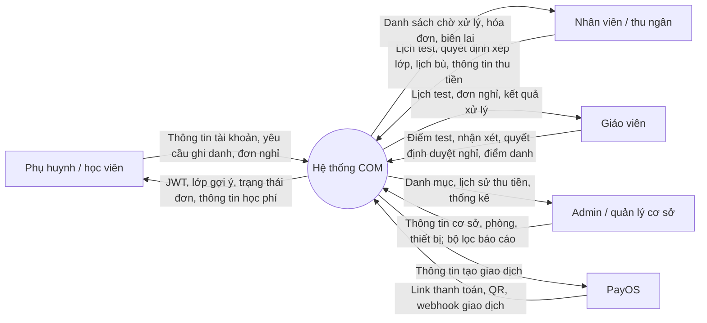
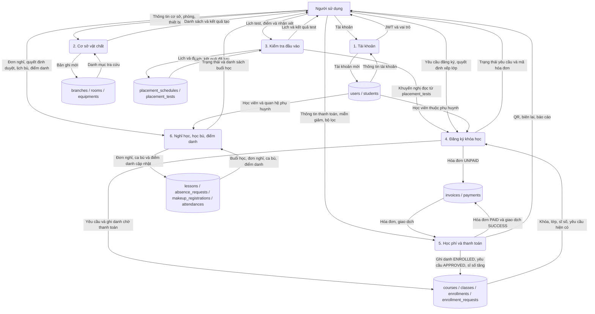
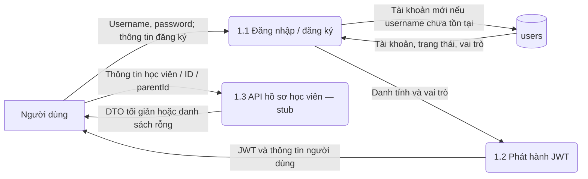
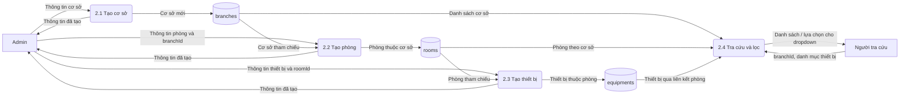
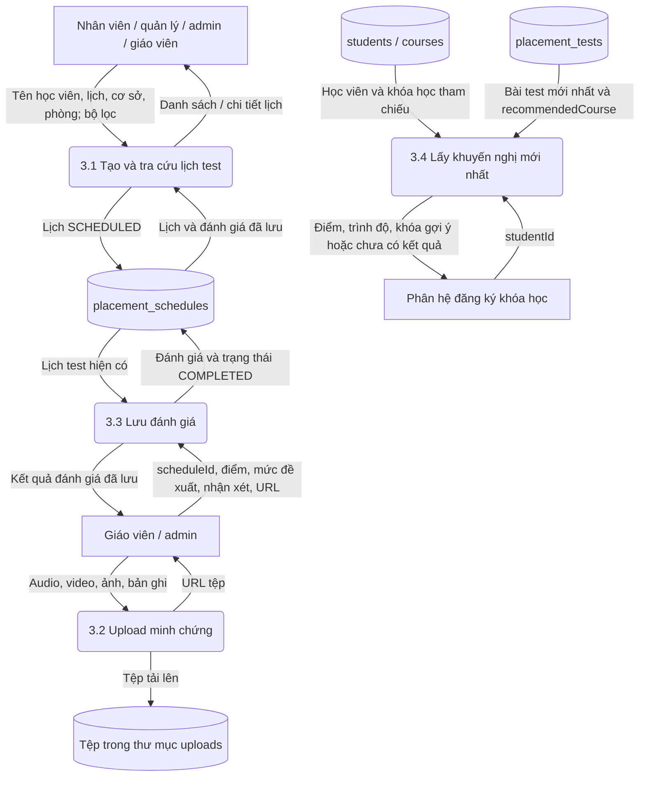
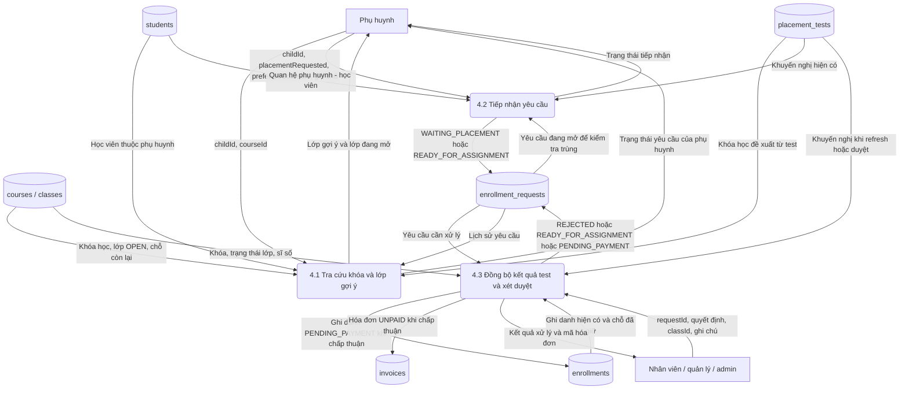
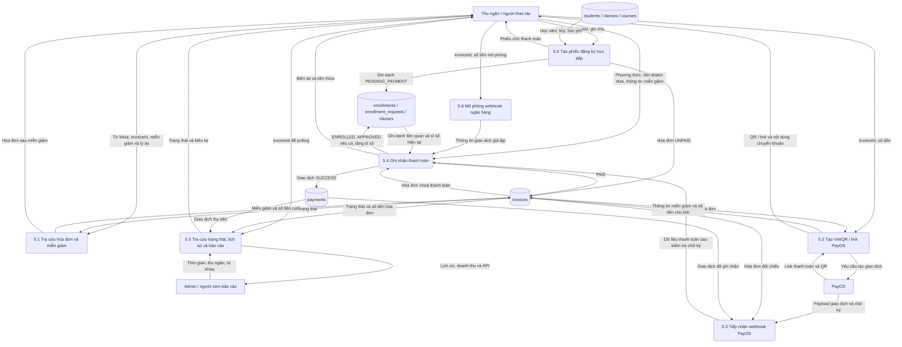
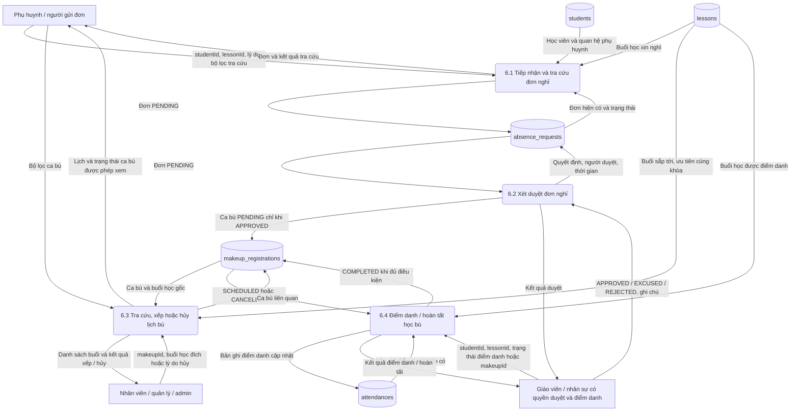
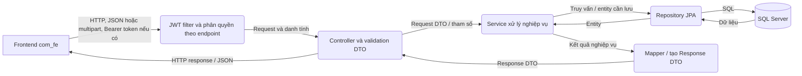

# Sơ đồ luồng dữ liệu nghiệp vụ — Course Operation Management

Đối chiếu controller, service và entity trong mã nguồn ngày 05/10/2026. Sơ đồ mô tả các luồng đã xuất hiện trong code, không coi mô tả trong README hoặc Swagger là chức năng đã hoàn thiện. Các vai trò trên sơ đồ là tác nhân nghiệp vụ; xem ghi chú để phân biệt với quyền API thực tế.

Quy ước: hình chữ nhật = tác nhân; hình bo góc = tiến trình; hình trụ = kho dữ liệu. Mũi tên mang tên dữ liệu được truyền, không biểu diễn thứ tự thời gian. Các bảng được nhóm theo nghiệp vụ để sơ đồ dễ đọc.

## 1. Sơ đồ ngữ cảnh

## 2. DFD tổng quan các phân hệ

## 3. Tài khoản và hồ sơ học viên

- `login()` hiện kiểm tra trạng thái tài khoản nhưng **không so khớp password**; username chưa có sẽ được tạo tự động, vai trò suy ra từ username. Sơ đồ vì vậy không có bước xác minh mật khẩu thành công.
- `register()` dùng lại tài khoản nếu username đã tồn tại rồi phát hành token.
- `getUsersByRole`, `createStudent`, `getAllStudents`, `getStudentById` trong `AuthService` là stub; `createStudent` chưa ghi vào `students`. Các phân hệ khác vẫn đọc dữ liệu học viên có sẵn qua repository.

Nguồn: `features/auth/service/AuthService.java`, `features/auth/service/JwtService.java`.

## 4. Quản lý cơ sở, phòng học và thiết bị

Hiện có API tạo và tra cứu; chưa có API sửa/xóa trong `BranchFacilityController`. GET cơ sở được mở công khai; POST yêu cầu ADMIN.

Nguồn: `features/branch_facility_enrollment/controller/BranchFacilityController.java`, `service/impl/BranchFacilityServiceImpl.java`.

## 5. Lập lịch và đánh giá kiểm tra đầu vào

**Điểm chưa nối trong code:** `saveAssessment()` chỉ ghi `placement_schedules`, trong khi `getLatestRecommendation()` đọc `placement_tests`. Không có thao tác đồng bộ giữa hai bảng trong service này. Vì vậy, chấm xong trên màn hình lịch test chưa tự tạo kết quả mà luồng ghi danh đang cần.

Controller của phân hệ cho ADMIN, TEACHER, STAFF, BRANCH_MANAGER; thao tác chấm chỉ cho TEACHER/ADMIN. Có hàm lọc lịch theo email phụ huynh nhưng không đồng nghĩa PARENT được gọi controller này.

Nguồn: `features/placement_test/service/impl/PlacementTestServiceImpl.java`, `controller/PlacementTestController.java`, `shared/service/FileStorageService.java`.

## 6. Đăng ký khóa học và xếp lớp

- Không yêu cầu test: phải chọn khóa, yêu cầu vào `READY_FOR_ASSIGNMENT`.
- Có yêu cầu test: có khóa đề xuất thì sẵn sàng xếp lớp, chưa có thì `WAITING_PLACEMENT`. Gửi yêu cầu này **không tự tạo lịch test**.
- Duyệt: kiểm tra lớp OPEN, chỗ trống, đúng khóa, chưa ghi danh trùng. Tạo ghi danh và hóa đơn chờ thanh toán; chưa tăng sĩ số tại bước này.
- Từ chối: cập nhật `REJECTED`, không tạo hóa đơn và ghi danh.
- Thanh toán thành công mới cập nhật `ENROLLED` và tăng sĩ số.

Nguồn: `features/course_enrollment/service/CourseEnrollmentService.java`.

## 7. Học phí, miễn giảm và thanh toán

- Ba đầu vào cùng dùng `processPayment()`: thao tác thu tiền trực tiếp, webhook PayOS, webhook mô phỏng.
- Sinh VietQR không tự chứng minh đã nhận tiền. API `bank-webhook-simulate` là giả lập, không phải thông báo từ ngân hàng thật.
- PayOS có mã tích hợp tạo link và kiểm tra chữ ký webhook; sơ đồ không khẳng định môi trường hiện tại đã cấu hình và vận hành giao dịch thật.
- `createDemoReservation()` tạo ghi danh và hóa đơn có hạn thanh toán sau một tháng. Không thể hiện tự hủy sau 24 giờ vì implementation hiện tại không làm việc đó.
- Cập nhật yêu cầu ghi danh sang `APPROVED` nằm trong `try/catch`; nếu thao tác này lỗi, code ghi log và tiếp tục.
- `/api/tuition-payment/**` hiện được `permitAll()` trong cấu hình bảo mật. Vai trò thu ngân/admin ở đây mô tả người sử dụng nghiệp vụ, không phải giới hạn truy cập đã được áp dụng đầy đủ.

Nguồn: `features/tuition_payment/service/impl/TuitionPaymentServiceImpl.java`, `gateway/PayOSGateway.java`, `shared/config/WebSecurityConfig.java`.

## 8. Xin nghỉ, duyệt nghỉ, xếp học bù và điểm danh

- Khi gửi đơn: kiểm tra học viên, buổi học, quan hệ con của phụ huynh và trùng đơn `PENDING`/`APPROVED`.
- Chỉ đơn `PENDING` được duyệt. `EXCUSED` và `REJECTED` cần ghi chú; chỉ `APPROVED` sinh ca bù.
- Danh sách buổi bù ưu tiên cùng khóa; nếu rỗng, code fallback sang các buổi sắp tới khác. Không diễn giải thành bảo đảm mọi ca đều cùng khóa hoặc đã kiểm tra đủ điều kiện sức chứa/trùng lịch.
- Xếp lịch không cho dùng chính buổi đã nghỉ, không xếp lại ca `COMPLETED`/`CANCELLED`.
- Điểm danh có thể hoàn tất ca bù liên quan; API hoàn tất học bù riêng còn ghi điểm danh `PRESENT`.

Nguồn: `features/attendance_makeup/service/impl/AbsenceMakeupServiceImpl.java`.

## 9. Đường đi kỹ thuật của dữ liệu

Đây là sơ đồ kỹ thuật bổ sung, không thay thế DFD nghiệp vụ. Không phải endpoint nào cũng yêu cầu JWT; service có thể tự tạo DTO thay vì dùng mapper riêng. Tài liệu được kiểm tra bằng đọc mã nguồn, chưa xác nhận qua chạy toàn bộ ứng dụng và giao dịch PayOS.
